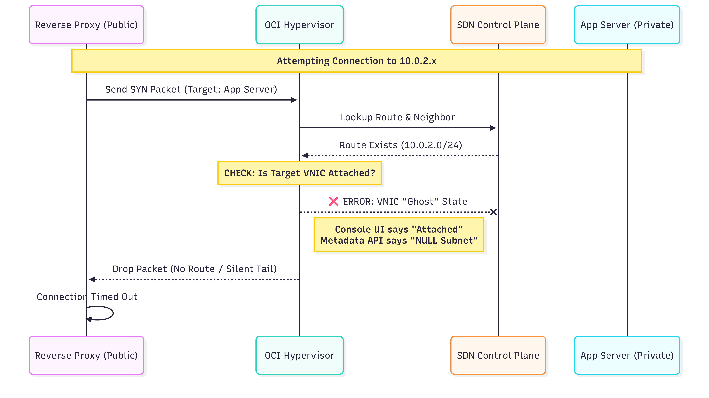

# OCI Multi-Tier Architecture & SDN Root Cause Analysis

##  Project Overview

This repository documents the design and implementation of a scalable **3-Tier Web Application** on Oracle Cloud Infrastructure (OCI). The primary goal was to architect a secure, production-grade cloud environment using strict network isolation.

During the implementation phase on OCI Free Tier (A1.Flex instances), a critical infrastructure anomaly was identified. This project evolved from a standard web deployment into a **complex network debugging case study**, resulting in the discovery of a platform-level SDN race condition.

---

##  Infrastructure & Architecture

The networking layer was configured using best practices for tier isolation, security, and controlled connectivity.

### **1. VCN & Subnet Design**

The architecture uses a "Hub and Spoke" logical isolation model within a single Virtual Cloud Network.

* **VCN Name:** `project-vcn`
* **CIDR Block:** `10.0.0.0/16`
* **Gateways:**
* **Internet Gateway:** For public subnet traffic.
* **NAT Gateway:** For private subnet outbound access (patching/updates).
* **Service Gateway:** Provides private access to OCI services (Autonomous DB, Object Storage).


| Subnet Type | CIDR          | Purpose 
| ---         |               |
| **Public**  | `10.0.1.0/24` | Hosts the Jump Host and Load Balancer (Reverse Proxy) 
| **Private** | `10.0.2.0/24` | Hosts the Application Server (No Public IP) 
| **Database**| `10.0.3.0/24` | Reserved for Autonomous Database (ATP) 

### **2. Compute Tier Configuration**

#### **  Bastion / Jump Host**

A secured entry point for managing private resources.

* **Instance Name:** `jump-host-1`
* **Subnet:** `public-subnet` (`10.0.1.0/24`)
* **Public IP:** Assigned
* **Security:** SSH keys restricted to admin IP.

#### ** Private Application Server**

The backend application server is deployed fully isolated from public exposure.

* **Instance Name:** `app-server-1`
* **Subnet:** `private-subnet` (`10.0.2.0/24`)
* **Network Security Group:** `nsg-private`
* **Public IP:** None
* **Service:** NGINX configured as a backend web server.

**Integration:**
SSH access is strictly chained via the Jump Host. The NGINX service serves a custom validation page:

```html
<h1>Welcome from app-server-1 (OCI Private Subnet)</h1>

```

---

##  Incident Report: The "Ghost VNIC" Failure

**Severity:** Critical (Total Loss of Connectivity)
**Component:** OCI SDN Control Plane / Hypervisor
**Region:** EU-FRANKFURT (A1.Flex Availability Domain)

### Symptom

Despite correct Route Tables (`0.0.0.0/0` via NAT) and permissive Security Lists, the Reverse Proxy/Jump Host was unable to communicate with the App Server.

```bash
# Attempting to curl the App Server from the Public Subnet
curl -v http://10.0.2.38
> Error: No route to host

```

---

##  Technical Deep Dive: Root Cause Analysis

We performed a layered OSI investigation to isolate the failure. Below is the step-by-step debugging log.

### Phase 1: Layer 2 Analysis (Data Link)

We suspected an ARP failure. We checked the Neighbor Table and ran a packet capture.

**Command:** `ip neigh`

* **Result:** `FAILED` (No ARP entry for `10.0.2.38`).

**Command:** `sudo tcpdump -n -i any host 10.0.2.38`

* **Observation:** We saw outbound `SYN` packets generated by the OS, but **0 packets** were captured on the receiving interface.
* **Conclusion:** Packets were being dropped *before* leaving the hypervisor virtual interface.

### Phase 2: Layer 3 & Firewall Analysis (Network)

We verified the routing table and OS firewalls to ensure no local blocking.

**Command:** `ip route show`

* **Output:** `10.0.2.0/24 via 10.0.1.1` (Correct Gateway).

**Command:** `sudo systemctl stop firewalld` / `iptables -F`

* **Result:** No change in connectivity.

### Phase 3: The Breakthrough (Metadata Service)

We hypothesized a mismatch between the **Control Plane** (what the OCI Console shows) and the **Data Plane** (what the instance actually has). We queried the OCI Instance Metadata Service (IMDS).

**Command:**

```bash
curl http://169.254.169.254/opc/v1/instance/vnics | jq '.[0].subnetCidrBlock'

```

**The Discrepancy:**

* **OCI Console UI:** Shows status **"Attached"** to `10.0.2.0/24`.
* **Metadata API:** Returned `null`.

###  Root Cause

The App Server instance suffered from a **VNIC Ghost Attachment**. Due to a race condition in the OCI backend (specific to A1.Flex instances in the Frankfurt region), the Virtual Network Interface Card was provisioned but never successfully bound to the SDN fabric. The instance believed it was connected, but the hypervisor dropped all traffic because the virtual circuit was undefined.

**Resolution:**
The instance was terminated and recreated to force a fresh VNIC attachment handshake with the SDN controller. Connectivity was immediately restored.

---

##  Visualizing the Failure Mode

This diagram illustrates the specific point of failure discovered during the RCA.



---

## 🛠️ Technology Stack

* **Cloud Provider:** Oracle Cloud Infrastructure (OCI)
* **Compute:** OCI Ampere A1 Compute (ARM64 Architecture)
* **Networking:** VCN, Private/Public Subnets, Route Tables, NAT Gateway
* **Server:** NGINX (Reverse Proxy/Web Server)
* **Tools:** `tcpdump`, `ip route`, `oci-metadata`, Terraform

##  References

* [Detailed Debugging Log (PDF)](https://drive.google.com/file/d/1Vhy3CsZIkJ7XZOPA1Py4Lne7q16DZKZo/view?usp=sharing) - Full transcript of the 2-day investigation.

##  Author

**Avi Maheshwari**
*OCI Architect Associate*